# Simple Speech Assistant con WebSockets

Este proyecto implementa un asistente de voz basado en WebSockets que permite interactuar con un equipo de agentes mediante voz y texto. La arquitectura utiliza FastAPI para el backend y Streamlit para la interfaz de usuario, comunicándose a través de WebSockets para permitir respuestas en tiempo real.

## Características principales

- 🎤 **Entrada por voz**: Permite grabar mensajes de voz o subir archivos de audio
- 🔊 **Salida por voz**: Convierte las respuestas de texto a voz con gTTS
- 💬 **Procesamiento de lenguaje natural**: Utiliza un equipo de agentes especializados para procesar consultas
- 🌐 **Arquitectura WebSocket**: Comunicación bidireccional en tiempo real
- 🚀 **Diseño escalable**: Separa el frontend del backend permitiendo múltiples clientes

## Arquitectura

El sistema está compuesto por los siguientes componentes:


1. **Servidor FastAPI (app.py)**:
   - Proporciona endpoints WebSocket para la comunicación en tiempo real
   - Ejecuta los agentes en procesos separados
   - Gestiona múltiples conexiones de clientes

2. **Cliente Streamlit (streamlit_client.py)**:
   - Ofrece una interfaz gráfica para el usuario
   - Graba y transcribe audio utilizando Whisper
   - Se comunica con el servidor mediante WebSockets
   - Sintetiza las respuestas en audio mediante gTTS

3. **Agentes (agents.py)**:
   - Define un equipo de agentes especializados:
     - Constructor de recetas
     - SQL Master
     - RAG Master
     - Recomendador Master
     - Team Lider
   - Utiliza modelos de Ollama para generar respuestas

4. **Agent Runner (agent_runner.py)**:
   - Script auxiliar que ejecuta los agentes en un proceso separado
   - Evita interferencias con Streamlit y FastAPI

## Requisitos previos

- Python 3.7+
- [Ollama](https://ollama.ai/) instalado y ejecutándose
- Modelos necesarios para Ollama:
  - llama3.2:3b
  - HridaAI/hrida-t2sql-128k

## Instalación

1. Clonar el repositorio:
```bash
git clone https://github.com/tu-usuario/simple-speech-assistant.git
cd simple-speech-assistant
```

2. Crear un entorno virtual:
```bash
python -m venv venv
source venv/bin/activate  # En Windows: venv\Scripts\activate
```

3. Instalar las dependencias:
```bash
pip install -r requirements.txt
```

4. Asegurarse de tener Ollama ejecutándose y los modelos necesarios descargados:
```bash
# En una terminal separada
ollama serve

# En otra terminal
ollama pull llama3.2:3b
ollama pull HridaAI/hrida-t2sql-128k:latest
```

## Ejecución

### 1. Iniciar el servidor FastAPI

```bash
python app.py
```

Esto iniciará el servidor en `http://localhost:8000` con el endpoint WebSocket disponible en `ws://localhost:8000/ws/agent`.

### 2. Iniciar el cliente Streamlit

En otra terminal:

```bash
streamlit run streamlit_client.py
```

Esto abrirá automáticamente el cliente en su navegador predeterminado (generalmente en `http://localhost:8501`).

## Uso del cliente

1. **Conectar al servidor WebSocket**:
   - En la barra lateral, asegúrese de que la URL del WebSocket sea correcta (`ws://localhost:8000/ws/agent`)
   - Haga clic en "Connect to WebSocket"
   - Espere a que aparezca "WebSocket Connected" en verde

2. **Cargar el modelo Whisper**:
   - Seleccione el tamaño del modelo en la barra lateral (recomendado: "base")
   - Haga clic en "Load Whisper Model"
   - Espere a que aparezca "Whisper model loaded!"

3. **Interactuar con el asistente**:
   - **Por voz**: Haga clic en el botón de grabación, hable, y luego en "Process Recorded Audio"
   - **Por archivo**: Suba un archivo de audio y haga clic en "Process Uploaded File"
   - **Por texto**: Escriba su mensaje en el campo de texto y presione Enter

4. **Ver y escuchar respuestas**:
   - Las respuestas aparecerán en la columna "Conversation Transcript"
   - Si el Text-to-Speech está habilitado, escuchará la respuesta en audio

## Características avanzadas

### Configuración del idioma

- El asistente está configurado para trabajar en español por defecto
- Puede cambiar el idioma de la síntesis de voz en la barra lateral

### Modelos Whisper

- Puede seleccionar diferentes tamaños de modelo para el reconocimiento de voz:
  - **tiny**: El más rápido pero menos preciso
  - **base**: Buen equilibrio entre velocidad y precisión
  - **small/medium**: Más precisos pero requieren más recursos

### Personalización de agentes

Para modificar el comportamiento de los agentes, edite el archivo `agents.py`:

```python
# Ejemplo: Cambiar el modelo utilizado por un agente
recomendador_master = Agent(
    name="Recomendador Master",
    model=Ollama(id="otro-modelo:versión"),
    role="Eres un experto decorador de interiores..."
)
```

## Resolución de problemas

### Problemas de conexión WebSocket

- Verifique que el servidor FastAPI esté ejecutándose
- Asegúrese de que la URL del WebSocket sea correcta
- Compruebe que no haya firewalls bloqueando la conexión

### Errores de transcripción

- Intente con un modelo Whisper más grande
- Asegúrese de que el archivo de audio tenga buena calidad
- Verifique que el modelo se haya cargado correctamente

### Problemas con los agentes

- Compruebe que Ollama esté ejecutándose
- Verifique que los modelos necesarios estén descargados
- Revise los logs del servidor para errores específicos

## Diagrama de secuencia

```mermaid
sequenceDiagram
    participant U as Usuario
    participant SC as Cliente Streamlit
    participant F as Servidor FastAPI
    participant A as Agentes (Ollama)
    
    U->>SC: Habla o escribe mensaje
    alt Entrada por voz
        SC->>SC: Transcribe con Whisper
    end
    SC->>F: Envía mensaje vía WebSocket
    F->>A: Ejecuta agentes
    A->>F: Devuelve respuesta
    F->>SC: Envía respuesta vía WebSocket
    SC->>SC: Convierte texto a voz (si está activado)
    SC->>U: Muestra y/o reproduce respuesta
```



## Notas de desarrollo

- El servidor FastAPI utiliza procesos asíncronos para manejar múltiples conexiones
- El cliente Streamlit ejecuta el WebSocket en un hilo separado para no bloquear la interfaz
- Las respuestas de los agentes se ejecutan en procesos separados para evitar interferencias
- Se implementa caché para las conversiones de texto a voz para mejorar el rendimiento