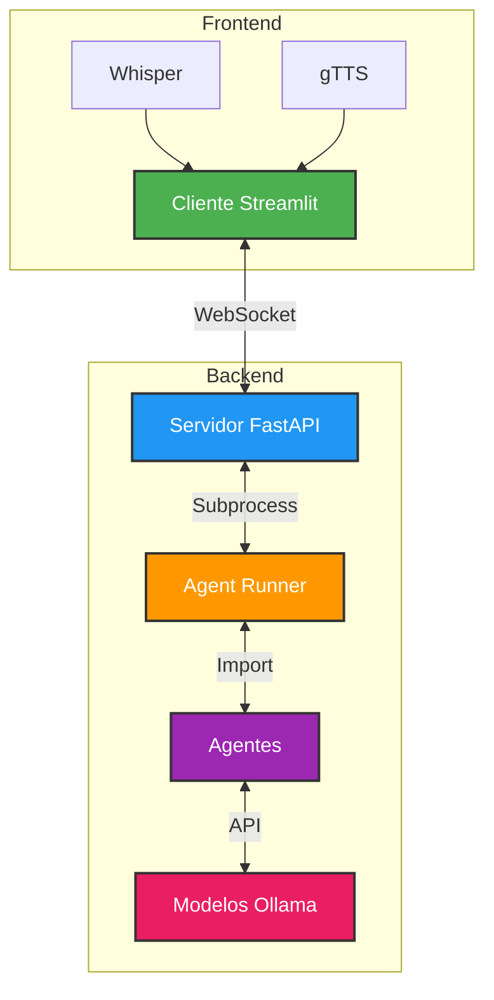

```mermaid
graph TD
    A[Cliente Streamlit] <-->|WebSocket| B[Servidor FastAPI]
    B <-->|Subprocess| C[Agent Runner]
    C <-->|Import| D[Agentes]
    D <-->|API| E[Modelos Ollama]
    
    subgraph Frontend
        A
        A1[Whisper] --> A
        A2[gTTS] --> A
    end
    
    subgraph Backend
        B
        C
        D
        E
    end
    
    style A fill:#4CAF50,stroke:#333,stroke-width:2px,color:#fff
    style B fill:#2196F3,stroke:#333,stroke-width:2px,color:#fff
    style C fill:#FF9800,stroke:#333,stroke-width:2px,color:#fff
    style D fill:#9C27B0,stroke:#333,stroke-width:2px,color:#fff
    style E fill:#E91E63,stroke:#333,stroke-width:2px,color:#fff
```