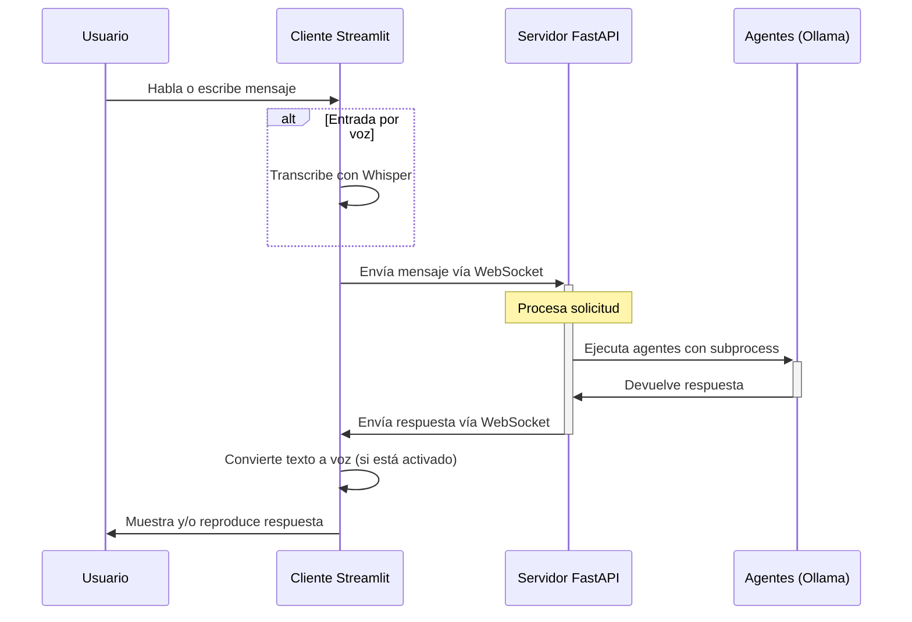

```mermaid
sequenceDiagram
    participant U as Usuario
    participant SC as Cliente Streamlit
    participant F as Servidor FastAPI
    participant A as Agentes (Ollama)
    
    U->>SC: Habla o escribe mensaje
    alt Entrada por voz
        SC->>SC: Transcribe con Whisper
    end
    SC->>+F: Envía mensaje vía WebSocket
    Note over F: Procesa solicitud
    F->>+A: Ejecuta agentes con subprocess
    A->>-F: Devuelve respuesta
    F->>-SC: Envía respuesta vía WebSocket
    SC->>SC: Convierte texto a voz (si está activado)
    SC->>U: Muestra y/o reproduce respuesta
```    